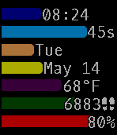
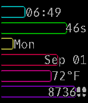
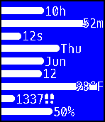
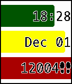
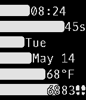
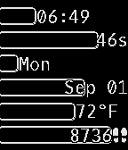
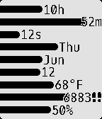
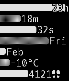
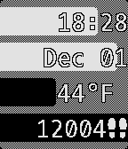

# ProgBars
## A Watchface App for Pebble Smartwatches
[ProgBars on the Pebble appstore.](https://apps.getpebble.com/applications/58ce72e56ca3876a5e001569)

ProgBars is a super-customizable watchface that displays all the information you would ever need on a watch in a compact, vibrant, easy to read fashion. Choose different bars to show time, date, temperature, step count, and battery. You can choose the color of each bar as well as the text and background. The bars can be drawn either solid or outlined. There are trillions of possible combinations! 

### Endless customization possibilities
    

        
### Works on Pebble Time (full color) as well as Pebble and Pebble 2 (black and white)
    

### Configuration page allows you to choose exactly how to display the information
  
        
## Code Overview
The app consists of two components:

* A C application running natively on the watch itself. This is written using the Pebble C API. The C component holds most of the runtime logic and is responsible for rendering the display and reading time, health, and battery data from the watch.

* A JavaScript component running on the phone within the Pebble mobile app. This is written using the PebbleKit JS framework. The JavaScript component creates the dynamic configuration page using the [Clay](https://github.com/pebble/clay) framework and sends the user preferences to the watch. It also accesses the web through the phone's connection in order to retrieve weather information.

Comunication between the components is acheived using the [Pebble AppMessage API](https://developer.pebble.com/docs/c/Foundation/AppMessage/).

### C
[bars.c](src/c/bars.c): Contains most of the app's logic, including displaying the bars and text labels and handling events from the time, health, and battery services. Also handles messages received from the phone, namely weather updates and user settings.

[configuration.c](src/c/configuration.c): Handles loading and saving settings and reading settings received in AppMessages from the phone.

[main.c](src/c/main.c): Ties into the app event loop and initiliazes the AppMessage communication.

[utilities.c](src/c/utilities.c): Utility functions that are not specific to the application.

### JavaScript
[clayfunctions.js](src/pkjs/clayfunctions.js): Code that is injected into the configuration page generated by Clay. Shows and hides controls dynamically.

[claylayout.js](src/pkjs/claylayout.js): Generates JSON that describes the Clay configuration page.

[index.js](src/pkjs/index.js): Launches the configuration page. Also handles AppMessages received from the watch.

[openweathermapkey.js](src/pkjs/openweathermapkey.js): Contains the key for the [OpenWeatherMap API](http://openweathermap.org/). If you want to build this proejct yourself, you must supply your own key here.

[weather.js](src/pkjs/weather.js): Fetches weather data from the [OpenWeatherMap API](http://openweathermap.org/).
